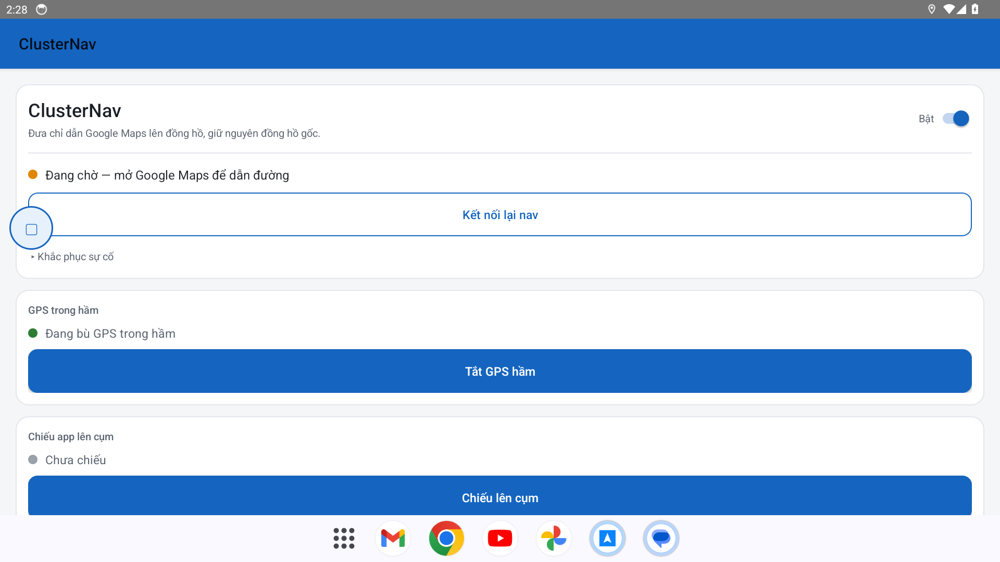
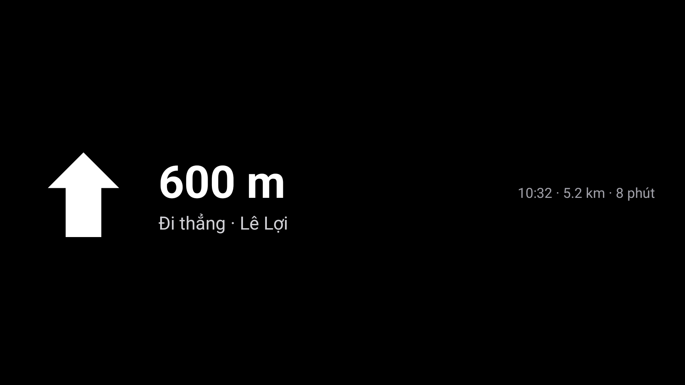
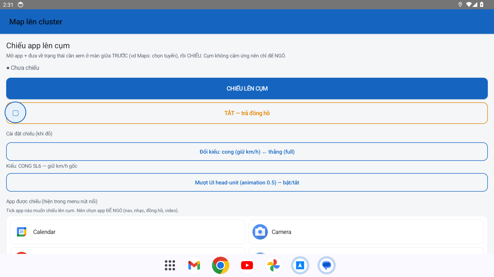
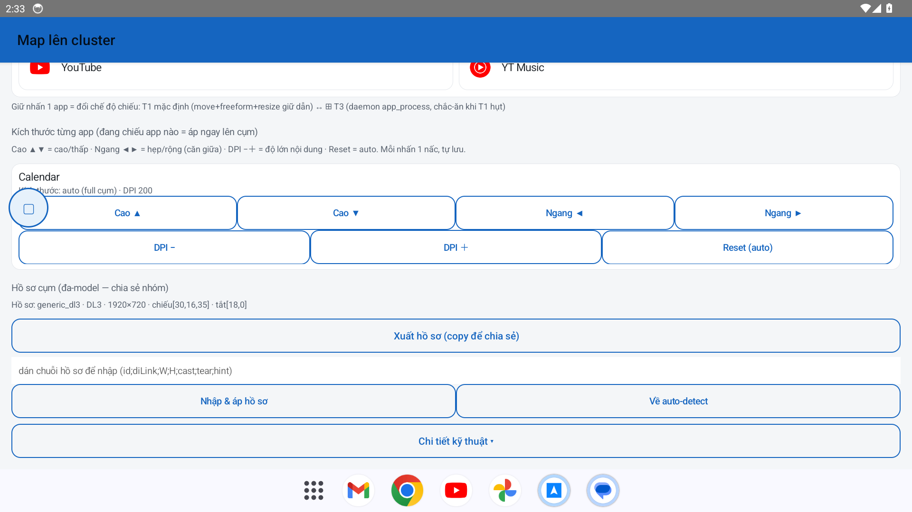

# Hướng dẫn sử dụng ClusterNav

> Ảnh minh hoạ giao diện app (chụp từ emulator, dữ liệu demo). Trên xe thật giao diện y hệt; phần chiếu sẽ hiện trên **cụm đồng hồ**.

## 1. Cài đặt

1. Tải APK: [`apk/ClusterNav-0.28-release.apk`](../apk/ClusterNav-0.28-release.apk) → cài:
   ```bash
   adb install -r ClusterNav-0.28-release.apk
   ```
   (hoặc copy vào máy bấm cài — cho phép "cài từ nguồn không xác định").
2. Trên xe bật một lần: **Developer options → USB debugging** + **adb tcp 5555**.
3. Cấp quyền cho ClusterNav:
   - **Notification access** (để đọc dẫn đường Google Maps) — *bắt buộc*.
   - **Mock location app = ClusterNav** (Developer options) — cho GPS hầm.
   - **Hiển thị trên ứng dụng khác** (overlay) — cho nút nổi (bubble).

## 2. Màn hình chính



- **Bật/Tắt** (góc phải): bật ClusterNav.
- **Trạng thái**: "Đang chờ — mở Google Maps để dẫn đường" → khi bắt đầu dẫn sẽ đổi.
- **Kết nối lại nav**: khi nav trên cụm không lên, bấm để bind lại.
- **GPS trong hầm**: bật/tắt dịch vụ bù GPS.
- **Chiếu app lên cụm**: nút chiếu + vào Cài đặt chiếu.

## 3. Đưa dẫn đường lên cụm (giữ nguyên đồng hồ)

Bật app → mở **Google Maps** dẫn đường như bình thường. Mũi tên rẽ + khoảng cách + tên đường + ETA sẽ hiện trên cụm, **đồng hồ gốc vẫn còn**:



> Không chiếm màn — chỉ thêm dải chỉ dẫn. Đây là cách nhẹ nhất, khuyên dùng khi chỉ cần mũi tên + km.

## 4. Chiếu nguyên app lên cụm (giữ phiên dẫn — T1)

Khi muốn xem **nguyên bản đồ** (Google Maps / VietMap / Waze / Apple CarPlay) trên cụm mà **vẫn giữ tuyến đang dẫn**:



1. Mở **Cài đặt chiếu** → **tick** app muốn chiếu.
2. (Tuỳ chọn) **giữ-nhấn** app để đổi chế độ: **T1 mặc định** (giữ dẫn) ↔ **⊞ T3** (dự phòng khi T1 hụt).
3. Mở app đó ở **màn giữa** và **bắt đầu dẫn TRƯỚC**.
4. Nhấn **nút nổi (bubble)** hoặc **Chiếu lên cụm**.

> ⚠️ **Quan trọng:** phải để app **đang dẫn** rồi mới chiếu — nếu chưa dẫn, app sẽ mở lại từ đầu (mất tuyến).
>
> **Đổi kiểu** (khi đỗ): *cong (giữ km/h)* ↔ *thẳng (full màn)*. **TẮT — trả đồng hồ** để về đồng hồ gốc.

## 5. Chỉnh kích thước từng app (scale)

Mỗi app một tỷ lệ khác nhau → chỉnh riêng bằng **nút mũi tên**, nhấn tới khi vừa mắt (tự lưu, áp ngay lên cụm nếu đang chiếu):



- **Cao ▲ / ▼** — cao / thấp (căn giữa dọc)
- **Ngang ◀ / ▶** — hẹp / rộng (căn giữa) → CarPlay/GMaps bị kéo ngang thì bấm ◀ cho gọn vào giữa
- **DPI − / ＋** — nội dung to / nhỏ
- **Reset (auto)** — về full cụm

## 6. GPS trong hầm (dead-reckon)

Bật ở màn chính. Khi mất GPS (hầm, gầm cầu), app bù vị trí bằng **tốc độ + góc lái** để Google Maps đi tiếp; ra hầm tự về GPS thật. Cần chọn ClusterNav làm *mock location app*.

## 7. Nhiều dòng xe (Seal / SL6 / Han / Tang)

Phần **Hồ sơ cụm** (trong Cài đặt chiếu) tự nhận diện kích thước cụm. Nếu xe lạ hiển thị sai:
- **Xuất hồ sơ** → copy chuỗi chia sẻ trong nhóm.
- **Nhập & áp hồ sơ** → dán chuỗi của người đã chỉnh đúng cho dòng xe bạn.
- **Về auto-detect** → quay lại tự dò.

## 8. Gỡ lỗi thường gặp

| Hiện tượng | Cách xử |
|---|---|
| Nav không lên cụm | Bấm **Kết nối lại nav**; vẫn không thì **reboot đầu xe** (AmapService kẹt). |
| Chiếu xong mất tuyến dẫn | Phải **bắt đầu dẫn TRƯỚC** khi chiếu; dùng **T1** (không phải mở mới). |
| App chiếu bị méo/lệch | Chỉnh **nút mũi tên** ở mục 5 (Ngang ◀ thu hẹp, DPI chỉnh độ lớn). |
| Cài bản mới báo lỗi chữ ký | Dùng bản **release** (`install -r`) — cùng chữ ký, khỏi gỡ. |
| Sau khi cài đè, nav mất | Tắt/bật lại **Notification access** cho ClusterNav. |

---
Chi tiết kỹ thuật (cơ chế chiếu, AutoContainer, dead-reckon): xem `docs/reference/` và mã nguồn `app/src`.
