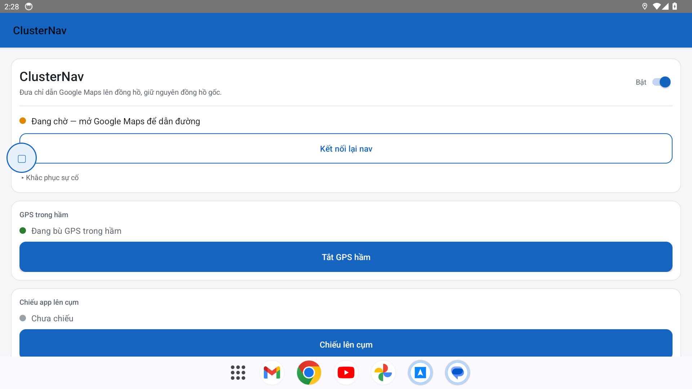
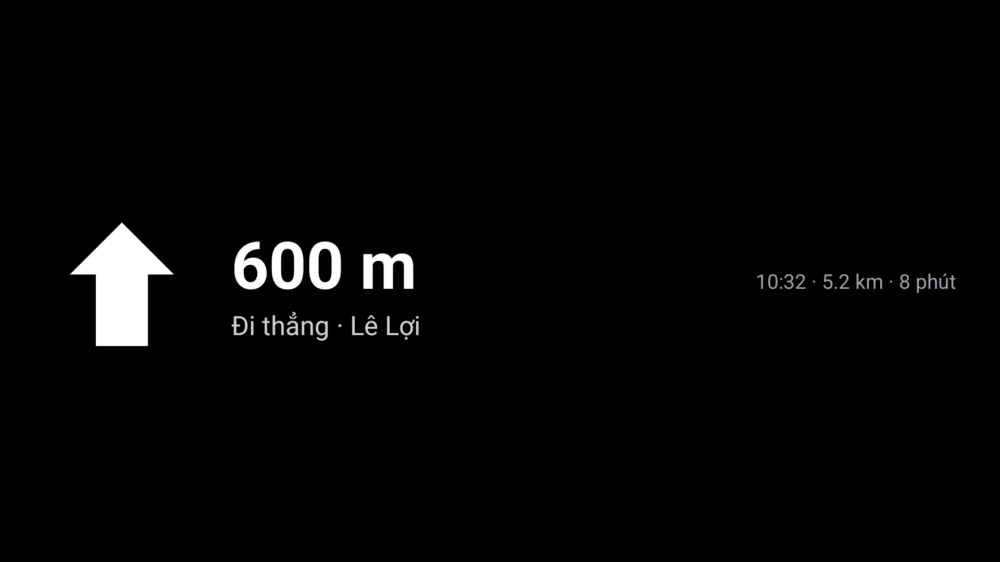
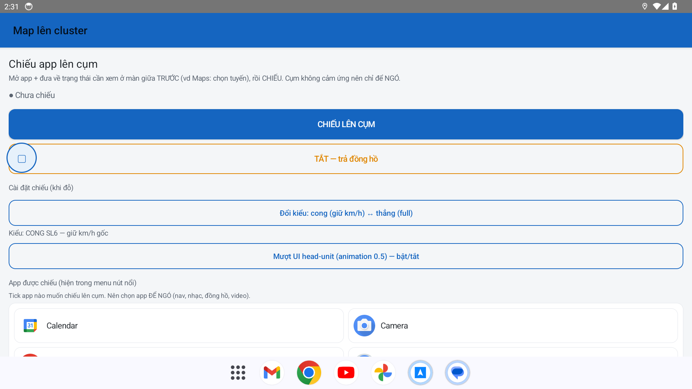
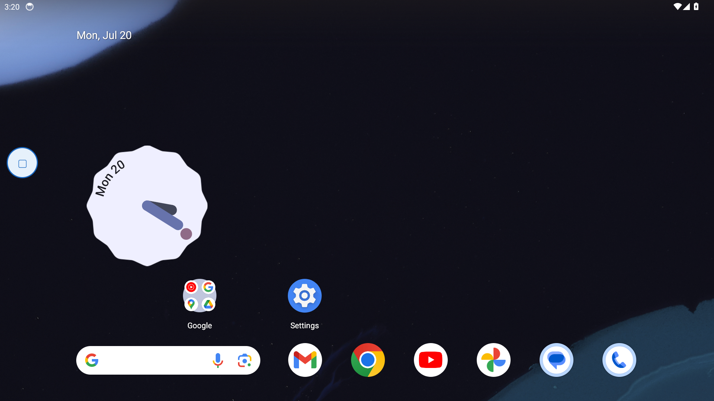
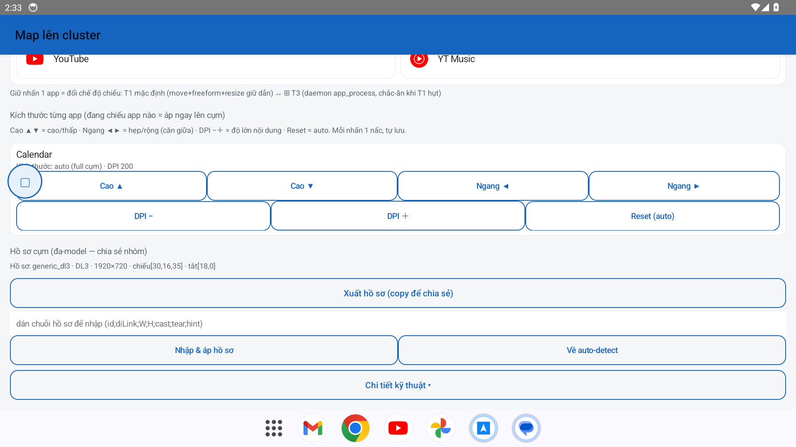

# ClusterNav — Hướng dẫn lịch sử đã lưu trữ

> [!CAUTION]
> **ARCHIVED / UNSUPPORTED — KHÔNG PHẢI HƯỚNG DẪN CÀI ĐẶT HIỆN TẠI.** Tài liệu và ảnh dưới đây mô tả giao diện emulator/legacy quanh v0.35–v0.36. Không APK nào trong repo hiện được công bố là bản hỗ trợ. Không dùng tài liệu này để cài lên xe, bật mock location, xác nhận T1/T3, hoặc suy ra bản hiện tại đã an toàn/hoàn tác được.

## 1. Trạng thái hiện tại

ClusterNav đang re-baseline về đúng **hai track độc lập**:

1. **Navigation + HUD** — một nguồn/phiên dẫn đường, hai đầu ra Cluster-lane và HUD độc lập.
2. **Cluster Cast** — state/journal/execution/recovery/UI riêng.

Runtime mục tiêu vẫn **NO-GO**; car hiện không truy cập được; direct UX/on-car evidence là **NOT STARTED**. Vì vậy link tải và lệnh `adb install` cũ đã bị rút khỏi hướng dẫn công khai. Chỉ một release tương lai gắn exact source + APK SHA/signature/version/flags + off-car evidence + exact-build on-car PASS mới được phép có hướng dẫn cài.

**Dead Reckon/GPS hầm đã REMOVE khỏi product baseline.** Không chọn ClusterNav làm mock-location app cho target product. Legacy code/provider cleanup chưa được phép thực hiện cho tới khi hoàn tất review và kế hoạch retirement riêng.

## 2. Ảnh giao diện lịch sử

Các ảnh sau là artifact emulator lịch sử, không phải target UX và không chứng minh hành vi trên xe:

- `images/man-hinh-chinh.png` — dashboard trộn nhiều chức năng; target mới chỉ còn hai Home cards.
- `images/nav-card.png` — minh hoạ Nav-lane lịch sử; chưa phải exact-build evidence.
- `images/cai-dat-chieu.png` — màn Cast legacy; không phải V2 durable-state UI.
- `images/nut-noi.png` — Bubble legacy với toggle/long-press; target mới dùng menu xác định và Stop chỉ khi `StopDisposition=AVAILABLE`.
- `images/chinh-scale.png` — điều chỉnh legacy; target mới yêu cầu workspace riêng, target/epoch binding và verified apply.

## 3. Hành vi legacy đã rút claim

Các mô tả sau chỉ là lịch sử và **không được coi là tính năng hiện tại**:

- T1 “giữ dẫn”, T3 fallback, long-press đổi policy và bubble toggle mù.
- Scale/DPI/overscan áp trực tiếp hoặc cờ global tự áp.
- CarPlay/Android Auto “giữ phiên” không kèm durable V2 baseline và exact-build continuity evidence.
- GPS hầm/Dead Reckon bơm mock location và các câu “tự về GPS thật”, “failsafe”, “gỡ sạch”.
- Tự nhận mọi model hoặc tuyên bố UI trên xe giống emulator.
- `install -r`/“cùng chữ ký” như hướng dẫn nâng cấp chung; mỗi APK phải được xác minh chữ ký và provenance riêng.

## 4. Target UX được duyệt về tài liệu

- Home có đúng hai cards: **Navigation + HUD** và **Cluster Cast**.
- Navigation chia sẻ source/session nhưng lane và HUD có queue/executor/deadline/health riêng.
- Cast render canonical immutable `CastUiStateV2`; UI recreation phát zero mutation.
- Stop tương tác chỉ tồn tại khi authoritative `StopDisposition=AVAILABLE`.
- Interaction context PARKED/MOVING/UNKNOWN chỉ là metadata chẩn đoán và không khóa chức năng. Destructive recovery vẫn fail closed nếu thiếu owner/session-loss/two-sample/confirmation/one-attempt proof.
- Diagnostics read-only, bounded, partial-capable và không phải runtime pipeline thứ ba.
- Dead Reckon không có card/state/setup/action trong target UX.

Đây là contract hiện hành. Source/JVM off-car đã được implement và kiểm thử; exact-build/on-car vẫn chưa bắt đầu.

## 5. Nguồn tài liệu hiện hành

- [`specs/cluster-cast-rebaseline.html`](specs/cluster-cast-rebaseline.html)
- [`specs/clusternav-uxui-rebaseline.html`](specs/clusternav-uxui-rebaseline.html)
- [`specs/clusternav-two-track-final-plan.html`](specs/clusternav-two-track-final-plan.html)
- [`specs/dead-reckon-revalidation.html`](specs/dead-reckon-revalidation.html)
- [`HISTORICAL-ARTIFACTS.md`](HISTORICAL-ARTIFACTS.md)

Các recipe/checklist cũ trong `docs/reference/`, `docs/diagnostics/` và `docs/review/` là historical context. Không chạy lệnh mutating/on-car từ các file đó nếu chưa có execution stage, exact APK SHA, install authorization và car case được phê duyệt riêng.
